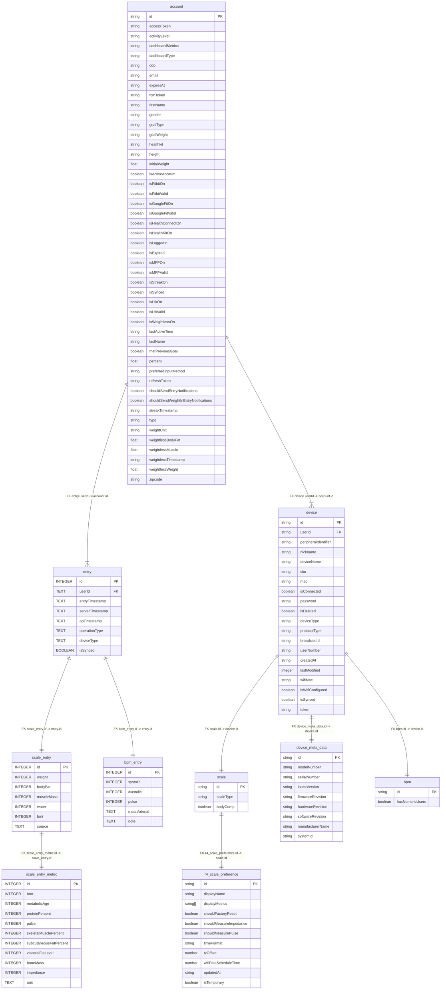
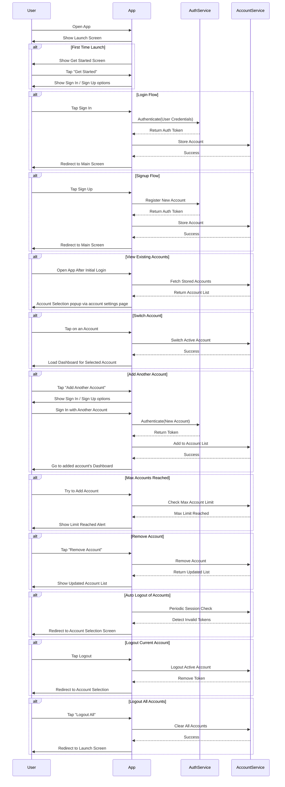

# Android

This directory contains the Android-specific code and resources for the MeApp project.

## Structure

-   `app/` - Main application source code
-   `build.gradle` - Gradle build configuration
-   Other Android-specific files and folders

## Getting Started

1. Open this folder in Android Studio.
2. Sync Gradle and build the project.
3. Run on an emulator or connected device.

## Notes

-   Ensure you have the correct SDK and dependencies installed.
-   Refer to the main project documentation for shared information.

---

## Database Schema

### Table: account

Stores user account details such as personal info, tokens, and app settings.

| Column Name                          | Type    | Description                                       |
| ------------------------------------ | ------- | ------------------------------------------------- |
| id                                   | string  | Primary key for the account                       |
| accessToken                          | string  | OAuth or app-specific access token                |
| activityLevel                        | string  | User’s activity level (e.g., low, moderate, high) |
| dashboardMetrics                     | string  | Metrics selected for dashboard display            |
| dashboardType                        | string  | Layout type of the user’s dashboard               |
| dob                                  | string  | Date of birth                                     |
| email                                | string  | User email address                                |
| expiresAt                            | string  | Access token expiration time                      |
| fcmToken                             | string  | Firebase Cloud Messaging token                    |
| firstName                            | string  | First name of the user                            |
| gender                               | string  | Gender of the user                                |
| goalType                             | string  | Type of health/fitness goal (e.g., weight loss)   |
| goalWeight                           | string  | Target weight as defined by the user              |
| healthkit                            | string  | Identifier or status related to Apple HealthKit   |
| height                               | string  | Height of the user                                |
| initialWeight                        | float   | Weight at account creation or goal start          |
| isActiveAccount                      | boolean | Indicates if the account is currently active      |
| isFitbitOn                           | boolean | Whether Fitbit integration is enabled             |
| isFitbitValid                        | boolean | Whether Fitbit integration is valid/authenticated |
| isGoogleFitOn                        | boolean | Whether Google Fit is enabled                     |
| isGoogleFitValid                     | boolean | Whether Google Fit integration is valid           |
| isHealthConnectOn                    | boolean | Whether Health Connect integration is enabled     |
| isHealthKitOn                        | boolean | Whether Apple HealthKit is enabled                |
| isLoggedIn                           | boolean | If the user is logged in with active session      |
| isExpired                            | boolean | Whether the account/session is expired            |
| isMFPOn                              | boolean | Whether MyFitnessPal integration is enabled       |
| isMFPValid                           | boolean | Whether MFP integration is valid                  |
| isStreakOn                           | boolean | If streak tracking is enabled                     |
| isSynced                             | boolean | Is account details are synced online              |
| isUAOn                               | boolean | Under Armour connection enabled                   |
| isUAValid                            | boolean | Under Armour connection valid                     |
| isWeightlessOn                       | boolean | Weightless mode enabled (app-specific)            |
| lastActiveTime                       | string  | Timestamp of last activity                        |
| lastName                             | string  | Last name of the user                             |
| metPreviousGoal                      | boolean | If the user achieved the last set goal            |
| percent                              | float   | Goal completion or progress percent               |
| preferredInputMethod                 | string  | User's preferred data entry method                |
| refreshToken                         | string  | OAuth refresh token                               |
| shouldSendEntryNotifications         | boolean | Whether to send reminders for entries             |
| shouldSendWeightInEntryNotifications | boolean | Whether to send reminders for weight-ins          |
| streakTimestamp                      | string  | Timestamp for streak tracking                     |
| type                                 | string  | Account type or role                              |
| weightUnit                           | string  | Unit of weight measurement (kg/lb)                |
| weightlessBodyFat                    | float   | Offline/stored body fat value                     |
| weightlessMuscle                     | float   | Offline/stored muscle mass value                  |
| weightlessTimestamp                  | string  | Last updated timestamp for weightless data        |
| weightlessWeight                     | float   | Offline/stored weight value                       |
| zipcode                              | string  | User’s zip/postal code                            |

### Table: entry

Stores all user entry records with common properties for all device types.

| Column Name     | Type                              | Description                                         |
| --------------- | --------------------------------- | --------------------------------------------------- |
| id              | INTEGER PRIMARY KEY AUTOINCREMENT | Unique entry ID (PK)                                |
| userId          | TEXT NOT NULL                     | Foreign key referencing account.id                  |
| entryTimestamp  | TEXT NOT NULL                     | Timestamp when the entry was made                   |
| serverTimestamp | TEXT                              | Server-generated timestamp of entry receipt         |
| opTimestamp     | TEXT                              | Operation timestamp                                 |
| operationType   | TEXT NOT NULL                     | Type of operation (eg., 'create', 'delete', 'note') |
| deviceType      | TEXT NOT NULL                     | Device type (eg., 'scale', 'bgm' )                  |
| isSynced        | BOOLEAN                           | Whether entry is synced online                      |

---

### Table: scale_entry

Stores scale-specific data for each entry.

| Column Name | Type                | Description                                     |
| ----------- | ------------------- | ----------------------------------------------- |
| id          | INTEGER PRIMARY KEY | FK to entry.id                                  |
| weight      | INTEGER             | Weight recorded in the entry                    |
| bodyFat     | INTEGER             | Body fat percentage recorded                    |
| muscleMass  | INTEGER             | Muscle mass recorded                            |
| water       | INTEGER             | Water percentage recorded                       |
| bmi         | INTEGER             | Body Mass Index                                 |
| source      | TEXT                | Source data (e.g.,'manual', 'lcbt scale'...etc) |

---

### Table: scale_entry_metric

Stores additional scale metrics for each entry.

| Column Name            | Type                | Description                    |
| ---------------------- | ------------------- | ------------------------------ |
| id                     | INTEGER PRIMARY KEY | FK to entry.id                 |
| bmr                    | INTEGER             | Basal Metabolic Rate           |
| metabolicAge           | INTEGER             | Calculated metabolic age       |
| proteinPercent         | INTEGER             | Protein percentage in the body |
| pulse                  | INTEGER             | Heart rate or pulse            |
| skeletalMusclePercent  | INTEGER             | Percentage of skeletal muscle  |
| subcutaneousFatPercent | INTEGER             | Subcutaneous fat percentage    |
| visceralFatLevel       | INTEGER             | Visceral fat level             |
| boneMass               | INTEGER             | Bone mass                      |
| impedance              | INTEGER             | Bioelectrical impedance        |
| unit                   | TEXT                | Unit of measurement            |

---

### Table: bpm_entry

Stores blood pressure monitor (BPM) specific data for each entry.

| Column Name  | Type                | Description              |
| ------------ | ------------------- | ------------------------ |
| id           | INTEGER PRIMARY KEY | FK to entry.id           |
| systolic     | INTEGER             | Systolic blood pressure  |
| diastolic    | INTEGER             | Diastolic blood pressure |
| pulse        | INTEGER             | Pulse                    |
| meanArterial | TEXT                | Mean arterial pressure   |
| note         | TEXT                | Additional notes         |

---

### Table: device

Stores user device details for connected devices.

| Column Name          | Type    | Description                         |
| -------------------- | ------- | ----------------------------------- |
| id                   | string  | Unique device ID (PK, FK)           |
| userId               | string  | User identifier                     |
| peripheralIdentifier | string  | Bluetooth peripheral ID             |
| nickname             | string  | User's nickname for the device      |
| sku                  | string  | SKU identifier                      |
| mac                  | string  | MAC address                         |
| password             | string  | Device password                     |
| isDeleted            | boolean | If the device is deleted            |
| deviceName           | string  | Device name                         |
| deviceType           | string  | Device type (e.g., 'scale', 'bgm')  |
| broadcastId          | string  | Broadcast ID                        |
| broadcastIdString    | string  | Broadcast ID as string              |
| userNumber           | string  | User number                         |
| protocolType         | string  | Protocol type (e.g., 'r4', 'a3')    |
| createdAt            | string  | Date added                          |
| lastModified         | integer | Last modified timestamp             |
| isSynced             | boolean | Whether device is synced online     |
| isConnected          | boolean | If the scale is currently connected |
| wifiMac              | string  | Wifi MAC (R4 scales)                |
| isWifiConfigured     | boolean | If WiFi is configured               |
| token                | string  | Token for scale authentication      |

---

### Table: scale

Stores user scale details for connected scales.

| Column Name | Type    | Description                             |
| ----------- | ------- | --------------------------------------- |
| id          | string  | Unique scale ID (PK, FK to device.id)   |
| scaleType   | string  | Scale setup type (wifi, bluetooth,etc.) |
| bodyComp    | boolean | Supports body composition               |

---

### Table: device_meta_data

| Column Name      | Type   | Description                       |
| ---------------- | ------ | --------------------------------- |
| id               | string | Unique scale ID (PK, FK to scale) |
| modelNumber      | string | Model number                      |
| serialNumber     | string | Serial number                     |
| firmwareRevision | string | Firmware revision                 |
| hardwareRevision | string | Hardware revision                 |
| softwareRevision | string | Software revision                 |
| manufacturerName | string | Manufacturer name                 |
| systemId         | string | Device MAC (A3 scales)            |
| latestVersion    | string | Latest firmware version           |

---

### Table: r4_scale_preference

| Column Name            | Type     | Description                       |
| ---------------------- | -------- | --------------------------------- |
| id                     | string   | Unique scale ID (PK, FK to scale) |
| displayName            | string   | Display name                      |
| displayMetrics         | string[] | Displayed metrics                 |
| shouldFactoryReset     | boolean  | Factory reset flag                |
| shouldMeasureImpedance | boolean  | Impedance measurement flag        |
| shouldMeasurePulse     | boolean  | Pulse measurement flag            |
| timeFormat             | string   | Time format                       |
| tzOffset               | number   | Timezone offset                   |
| wifiFotaScheduleTime   | number   | FOTA schedule time                |
| updatedAt              | string   | Last update timestamp             |

---

### Table: bgm

Stores user blood glucose monitor details for connected BGM devices.

| Column Name     | Type    | Description                                     |
| --------------- | ------- | ----------------------------------------------- |
| id              | string  | Unique BGM ID (PK, FK to device.id)             |
| hasNumericUsers | boolean | If device supports numeric users(e.g. User A/B) |

---

## Account Switching Feature

The following sequence diagram illustrates the user and system interactions for the account switching feature in the app:

