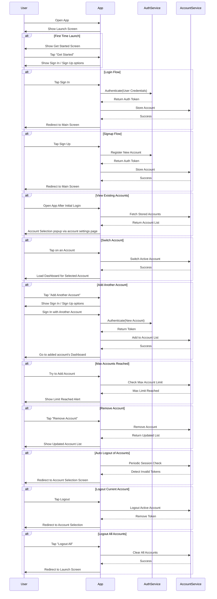

# Account Switching Flow

This document describes the account switching feature in the MeApp project, including user interactions and system processes.

## Overview

The account switching feature allows users to manage multiple accounts within the app, including:

-   Adding new accounts
-   Switching between accounts
-   Managing account settings
-   Handling account sessions
-   Removing accounts

## User Flow

The following sequence diagram illustrates the user and system interactions for the account switching feature:

## Key Features

1. **First Time Launch**

    - Shows Get Started screen
    - Guides user through initial sign-in/sign-up process

2. **Account Management**

    - Add multiple accounts
    - Switch between accounts
    - Remove accounts
    - View account list

3. **Session Management**

    - Automatic session validation
    - Token management
    - Auto logout for expired sessions

4. **Security**

    - Secure token storage
    - Session validation
    - Account isolation

5. **User Experience**
    - Smooth account switching
    - Clear account selection UI
    - Session status indicators

## Implementation Notes

1. **Account Storage**

    - Accounts are stored in the local database
    - Each account maintains its own session state
    - Account data is isolated between accounts

2. **Session Management**

    - Regular token validation
    - Automatic session refresh
    - Secure token storage

3. **UI/UX Considerations**

    - Clear account selection interface
    - Smooth transitions between accounts
    - Clear session status indicators

4. **Security Considerations**
    - Secure token storage
    - Account data isolation
    - Session validation
    - Secure account removal
