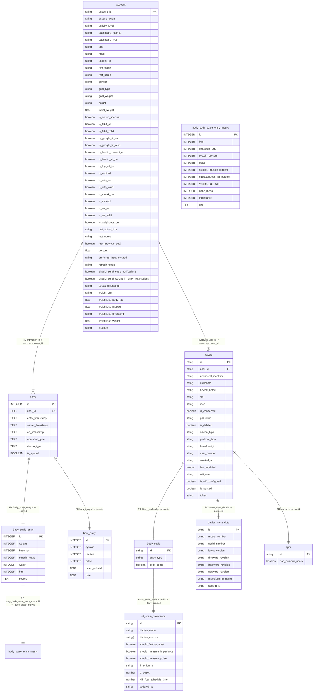

# Database Schema

This document describes the database schema for the MeApp project.

## Table: account

Stores user account details such as personal info, tokens, and app settings.

| Column Name                               | Type    | Description                                       |
| ----------------------------------------- | ------- | ------------------------------------------------- |
| account_id                                | string  | Primary key for the account                       |
| access_token                              | string  | OAuth or app-specific access token                |
| activity_level                            | string  | User's activity level (e.g., low, moderate, high) |
| dashboard_metrics                         | string  | Metrics selected for dashboard display            |
| dashboard_type                            | string  | Layout type of the user's dashboard               |
| dob                                       | string  | Date of birth                                     |
| email                                     | string  | User email address                                |
| expires_at                                | string  | Access token expiration time                      |
| fcm_token                                 | string  | Firebase Cloud Messaging token                    |
| first_name                                | string  | First name of the user                            |
| gender                                    | string  | Gender of the user                                |
| goal_type                                 | string  | Type of health/fitness goal (e.g., weight loss)   |
| goal_weight                               | string  | Target weight as defined by the user              |
| height                                    | string  | Height of the user                                |
| initial_weight                            | float   | Weight at account creation or goal start          |
| is_active_account                         | boolean | Indicates if the account is currently active      |
| is_fitbit_on                              | boolean | Whether Fitbit integration is enabled             |
| is_fitbit_valid                           | boolean | Whether Fitbit integration is valid/authenticated |
| is_google_fit_on                          | boolean | Whether Google Fit is enabled                     |
| is_google_fit_valid                       | boolean | Whether Google Fit integration is valid           |
| is_health_connect_on                      | boolean | Whether Health Connect integration is enabled     |
| is_health_kit_on                          | boolean | Whether Apple HealthKit is enabled                |
| is_logged_in                              | boolean | If the user is logged in with active session      |
| is_expired                                | boolean | Whether the account/session is expired            |
| is_mfp_on                                 | boolean | Whether MyFitnessPal integration is enabled       |
| is_mfp_valid                              | boolean | Whether MFP integration is valid                  |
| is_streak_on                              | boolean | If streak tracking is enabled                     |
| is_synced                                 | boolean | Is account details are synced online              |
| is_ua_on                                  | boolean | Under Armour connection enabled                   |
| is_ua_valid                               | boolean | Under Armour connection valid                     |
| is_weightless_on                          | boolean | Weightless mode enabled (app-specific)            |
| last_active_time                          | string  | Timestamp of last activity                        |
| last_name                                 | string  | Last name of the user                             |
| met_previous_goal                         | boolean | If the user achieved the last set goal            |
| percent                                   | float   | Goal completion or progress percent               |
| preferred_input_method                    | string  | User's preferred data entry method                |
| refresh_token                             | string  | OAuth refresh token                               |
| should_send_entry_notifications           | boolean | Whether to send reminders for entries             |
| should_send_weight_in_entry_notifications | boolean | Whether to send reminders for weight-ins          |
| streak_timestamp                          | string  | Timestamp for streak tracking                     |
| weight_unit                               | string  | Unit of weight measurement (kg/lb)                |
| weightless_body_fat                       | float   | Variant body fat value                            |
| weightless_muscle                         | float   | Variant muscle mass value                         |
| weightless_timestamp                      | string  | Last updated timestamp for weightless data        |
| weightless_weight                         | float   | Variant weight value                              |
| zipcode                                   | string  | User's zip/postal code                            |

## Table: entry

Stores all user entry records with common properties for all device types.

| Column Name      | Type                              | Description                                         |
| ---------------- | --------------------------------- | --------------------------------------------------- |
| id               | INTEGER PRIMARY KEY AUTOINCREMENT | Unique entry ID (PK)                                |
| account_id       | TEXT NOT NULL                     | Foreign key referencing account.account_id          |
| entry_timestamp  | TEXT NOT NULL                     | Timestamp when the entry was made                   |
| server_timestamp | TEXT                              | Server-generated timestamp of entry receipt         |
| op_timestamp     | TEXT                              | Operation timestamp                                 |
| operation_type   | TEXT NOT NULL                     | Type of operation (eg., 'create', 'delete', 'note') |
| device_type      | TEXT NOT NULL                     | Device type (eg., 'scale', 'bgm' )                  |
| is_synced        | BOOLEAN                           | Whether entry is synced online                      |

## Table: Body_scale_entry

Stores scale-specific data for each entry.

| Column Name | Type                | Description                                     |
| ----------- | ------------------- | ----------------------------------------------- |
| id          | INTEGER PRIMARY KEY | FK to entry.id                                  |
| weight      | INTEGER             | Weight recorded in the entry                    |
| body_fat    | INTEGER             | Body fat percentage recorded                    |
| muscle_mass | INTEGER             | Muscle mass recorded                            |
| water       | INTEGER             | Water percentage recorded                       |
| bmi         | INTEGER             | Body Mass Index                                 |
| source      | TEXT                | Source data (e.g.,'manual', 'lcbt scale'...etc) |

## Table: body_body_scale_entry_metric

Stores additional scale metrics for each entry.

| Column Name              | Type                | Description                    |
| ------------------------ | ------------------- | ------------------------------ |
| id                       | INTEGER PRIMARY KEY | FK to entry.id                 |
| bmr                      | INTEGER             | Basal Metabolic Rate           |
| metabolic_age            | INTEGER             | Calculated metabolic age       |
| protein_percent          | INTEGER             | Protein percentage in the body |
| pulse                    | INTEGER             | Heart rate or pulse            |
| skeletal_muscle_percent  | INTEGER             | Percentage of skeletal muscle  |
| subcutaneous_fat_percent | INTEGER             | Subcutaneous fat percentage    |
| visceral_fat_level       | INTEGER             | Visceral fat level             |
| bone_mass                | INTEGER             | Bone mass                      |
| impedance                | INTEGER             | Bioelectrical impedance        |
| unit                     | TEXT                | Unit of measurement            |

## Table: bpm_entry

Stores blood pressure monitor (BPM) specific data for each entry.

| Column Name   | Type                | Description              |
| ------------- | ------------------- | ------------------------ |
| id            | INTEGER PRIMARY KEY | FK to entry.id           |
| systolic      | INTEGER             | Systolic blood pressure  |
| diastolic     | INTEGER             | Diastolic blood pressure |
| pulse         | INTEGER             | Pulse                    |
| mean_arterial | TEXT                | Mean arterial pressure   |
| note          | TEXT                | Additional notes         |

## Table: device

Stores user device details for connected devices.

| Column Name           | Type    | Description                         |
| --------------------- | ------- | ----------------------------------- |
| id                    | string  | Unique device ID (PK, FK)           |
| account_id            | string  | User identifier                     |
| peripheral_identifier | string  | Bluetooth peripheral ID             |
| nickname              | string  | User's nickname for the device      |
| sku                   | string  | SKU identifier                      |
| mac                   | string  | MAC address                         |
| password              | string  | Device password                     |
| is_deleted            | boolean | If the device is deleted            |
| device_name           | string  | Device name                         |
| device_type           | string  | Device type (e.g., 'scale', 'bgm')  |
| broadcast_id          | string  | Broadcast ID                        |
| broadcast_id_string   | string  | Broadcast ID as string              |
| user_number           | string  | User number                         |
| protocol_type         | string  | Protocol type (e.g., 'r4', 'a3')    |
| created_at            | string  | Date added                          |
| last_modified         | integer | Last modified timestamp             |
| is_synced             | boolean | Whether device is synced online     |
| is_connected          | boolean | If the scale is currently connected |
| wifi_mac              | string  | Wifi MAC (R4 scales)                |
| is_wifi_configured    | boolean | If WiFi is configured               |
| token                 | string  | Token for scale authentication      |

## Table: Body_scale

Stores user scale details for connected scales.

| Column Name | Type    | Description                             |
| ----------- | ------- | --------------------------------------- |
| id          | string  | Unique scale ID (PK, FK to device.id)   |
| scale_type  | string  | Scale setup type (wifi, bluetooth,etc.) |
| body_comp   | boolean | Supports body composition               |

## Table: device_meta_data

| Column Name       | Type   | Description                       |
| ----------------- | ------ | --------------------------------- |
| id                | string | Unique scale ID (PK, FK to scale) |
| model_number      | string | Model number                      |
| serial_number     | string | Serial number                     |
| firmware_revision | string | Firmware revision                 |
| hardware_revision | string | Hardware revision                 |
| software_revision | string | Software revision                 |
| manufacturer_name | string | Manufacturer name                 |
| system_id         | string | Device MAC (A3 scales)            |
| latest_version    | string | Latest firmware version           |

## Table: r4_scale_preference

| Column Name              | Type     | Description                       |
| ------------------------ | -------- | --------------------------------- |
| id                       | string   | Unique scale ID (PK, FK to scale) |
| display_name             | string   | Display name                      |
| display_metrics          | string[] | Displayed metrics                 |
| should_factory_reset     | boolean  | Factory reset flag                |
| should_measure_impedance | boolean  | Impedance measurement flag        |
| should_measure_pulse     | boolean  | Pulse measurement flag            |
| time_format              | string   | Time format                       |
| tz_offset                | number   | Timezone offset                   |
| wifi_fota_schedule_time  | number   | FOTA schedule time                |
| updated_at               | string   | Last update timestamp             |

## Table: bgm

Stores user blood glucose monitor details for connected BGM devices.

| Column Name       | Type    | Description                                     |
| ----------------- | ------- | ----------------------------------------------- |
| id                | string  | Unique BGM ID (PK, FK to device.id)             |
| has_numeric_users | boolean | If device supports numeric users(e.g. User A/B) |

## Entity Relationship Diagram

