# Database Schema

Unified database schema for **meApp (Weight Gurus) + babyApp + bpmMobileApp4 (Balance Health)**.

- **Android**: Room DB — Version 3
- **iOS**: SwiftData

---

## Table Status Legend

| Symbol | Meaning |
|--------|---------|
| ✅ | Unchanged — reused from meApp |
| 🆕 | New table — added from babyApp / bpmApp |
| ✏️ | Modified — columns added |

---

## ACCOUNT LAYER

### `account` ✏️ Modified

Stores the logged-in user's identity. Shared across all 3 products.

| Column | Type | Key | Description |
|--------|------|-----|-------------|
| account_id | String | PK | Unique account ID from server |
| first_name | String | | First name |
| last_name | String | | Last name |
| dob | String | | Date of birth (ISO-8601) |
| email | String | UK | User email address (unique) |
| gender | String | | Gender |
| zipcode | String | | Zip/postal code |
| expires_at | String | | Token expiration time |
| fcm_token | String | | Firebase Cloud Messaging token |
| is_active_account | Boolean | | Currently active account |
| is_logged_in | Boolean | | User is logged in |
| is_expired | Boolean | | Session/account expired |
| is_synced | Boolean | | Synced with server |
| last_active_time | String | | Last activity timestamp |
| active_baby_id | String | FK → baby | **NEW** — currently selected baby profile |
| will_receive_emails | Boolean | | **NEW** — email subscription (from babyApp) |
| has_seen_app_review | Boolean | | **NEW** — app review prompt shown (from babyApp) |
| has_seen_scale_review | Boolean | | **NEW** — scale review prompt shown (from babyApp) |
| account_settings | String | | **NEW** — JSON array of AccountSetting key-value pairs (from babyApp) |

> **`account_settings`** stores `AccountSetting[]` as a JSON string inline.
> Example: `[{"key":"RjhSb2_pjsY","value":"videoWatched"}]`

---

### `weight_comp_settings` ✅

| Column | Type | Key | Description |
|--------|------|-----|-------------|
| account_id | String | PK, FK → account | |
| height | Int | | Height of the user (cm) |
| activity_level | String | | Activity level (low / moderate / high) |
| weight_unit | String | | Unit preference (kg / lb) |
| is_synced | Boolean | | Synced with server |

---

### `goal_settings` ✅

| Column | Type | Key | Description |
|--------|------|-----|-------------|
| account_id | String | PK, FK → account | |
| goal_type | String | | Goal type (lose / gain / maintain) |
| weight | Float | | Starting weight |
| goal_weight | String | | Target weight |
| goal_percent | Float | | Progress percent |
| is_synced | Boolean | | Synced with server |

---

### `streaks_settings` ✅

| Column | Type | Key | Description |
|--------|------|-----|-------------|
| account_id | String | PK, FK → account | |
| is_streak_on | Boolean | | Streak tracking enabled |
| streak_timestamp | String | | Streak last updated |
| is_synced | Boolean | | Synced with server |

---

### `weightless_settings` ✅

| Column | Type | Key | Description |
|--------|------|-----|-------------|
| account_id | String | PK, FK → account | |
| is_weightless_on | Boolean | | Weightless mode enabled |
| weightless_timestamp | String | | Last updated |
| weightless_weight | Float | | Weightless threshold |
| is_synced | Boolean | | Synced with server |

---

### `notification_settings` ✏️ Modified

| Column | Type | Key | Description |
|--------|------|-----|-------------|
| account_id | String | PK, FK → account | |
| should_send_entry_notifications | Boolean | | Entry notifications enabled |
| should_send_weight_in_entry_notifications | Boolean | | Show weight in notifications |
| should_send_baby_entry_notifications | Boolean | | **NEW** — baby entry notifications (from babyApp) |
| should_send_bpm_entry_notifications | Boolean | | **NEW** — blood pressure notifications (from bpmApp) |
| is_synced | Boolean | | Synced with server |

---

### `dashboard_settings` ✅

| Column | Type | Key | Description |
|--------|------|-----|-------------|
| account_id | String | PK, FK → account | |
| dashboard_metrics | String | | JSON list of selected metrics |
| dashboard_milestones | String | | JSON list of milestones |
| dashboard_type | String | | Layout type |
| is_synced | Boolean | | Synced with server |

---

### `integrations_settings` ✅

| Column | Type | Key | Description |
|--------|------|-----|-------------|
| account_id | String | PK, FK → account | |
| is_fitbit_on | Boolean | | Fitbit integration enabled |
| is_fitbit_valid | Boolean | | Fitbit authenticated |
| is_health_connect_on | Boolean | | Health Connect enabled |
| is_health_kit_on | Boolean | | HealthKit enabled |
| is_mfp_on | Boolean | | MyFitnessPal enabled |
| is_mfp_valid | Boolean | | MFP authenticated |
| is_synced | Boolean | | Synced with server |

---

## BABY PROFILE LAYER

### `baby` 🆕 New (from babyApp)

Stores baby/child profiles linked to an account. One account can have multiple baby profiles.

| Column | Type | Key | Description |
|--------|------|-----|-------------|
| baby_id | String | PK | Unique baby ID (UUID) |
| account_id | String | FK → account | Owner account (CASCADE DELETE) |
| name | String | | Baby's name |
| is_owned_by_account | Boolean | | Ownership flag |
| permissions | Int | | Permission bitmask |
| birthdate | String | | Date of birth (ISO-8601) |
| due_date | String | | Due date for unborn baby (ISO-8601) |
| is_born | Boolean | | Birth status |
| sex | String | | "male" / "female" |
| birth_weight_decigrams | Int | | Birth weight in decigrams |
| birth_length_millimeters | Int | | Birth length in mm |
| last_updated | String | | Last modified timestamp |
| is_synced | Boolean | | Synced with server |
| is_deleted | Boolean | | Soft deleted |

> **`account.active_baby_id`** → points to the currently selected baby profile.

---

## DEVICE LAYER

### `device` ✏️ Modified

Stores all paired hardware. `device_type` distinguishes between scales, baby scales, and BPM monitors.

| Column | Type | Key | Description |
|--------|------|-----|-------------|
| id | String | PK | Unique device ID (UUID) |
| account_id | String | FK → account | Owner account |
| device_type | String | | **"scale"** / **"babyScale"** / **"bpm"** / **"manual"** |
| peripheral_identifier | String | | BLE peripheral UUID |
| nickname | String | | User-assigned name |
| sku | String | | Product SKU |
| mac | String | | MAC address |
| password | Long | | Device password (encrypted) |
| is_deleted | Boolean | | Soft deleted |
| device_name | String | | Product name |
| broadcast_id | Long | | BLE broadcast ID |
| broadcast_id_string | String | | Hex broadcast ID |
| broadcast_name | String | | **NEW** — BLE advertisement name (e.g., "gG BPM 0603") |
| user_number | String | | Scale user slot |
| protocol_type | String | | "r4" / "a3" / "a6" |
| created_at | String | | Date paired |
| last_modified | Int | | **NEW** — Server last-modified epoch (from bpmApp / iOS parity) |
| is_synced | Boolean | | Synced with server |
| has_server_id | Boolean | | Device has a server-assigned ID |
| token | String | | Scale auth token |

---

### `body_scale` ✅

Sub-table for scale/babyScale devices.

| Column | Type | Key | Description |
|--------|------|-----|-------------|
| id | String | PK, FK → device | |
| scale_type | String | | "wifi" / "bluetooth" / "hybrid" |
| body_comp | Boolean | | Supports body composition |
| is_weigh_only_mode_enabled_by_others | Boolean | | Weigh-only mode set by another account |

---

### `bpm_device` ✅

Sub-table for BPM (blood pressure monitor) devices.

| Column | Type | Key | Description |
|--------|------|-----|-------------|
| id | String | PK, FK → device | |
| has_numeric_users | Boolean | | Supports User A / User B selection |

---

### `device_meta_data` ✅

| Column | Type | Key | Description |
|--------|------|-----|-------------|
| id | String | PK, FK → device | |
| model_number | String | | Model number |
| serial_number | String | | Serial number |
| firmware_revision | String | | Firmware version |
| hardware_revision | String | | Hardware version |
| software_revision | String | | Software version |
| manufacturer_name | String | | Manufacturer |
| system_id | String | | A3 scale MAC address |
| latest_version | String | | Latest available firmware |

---

### `r4_scale_preference` ✅

| Column | Type | Key | Description |
|--------|------|-----|-------------|
| id | String | PK, FK → body_scale | |
| display_name | String | | Display name on scale screen |
| display_metrics | List\<String\> | | Metrics shown on scale (JSON) |
| should_factory_reset | Boolean | | Pending factory reset |
| should_measure_impedance | Boolean | | Impedance measurement on |
| should_measure_pulse | Boolean | | Pulse measurement on |
| time_format | String | | 12h / 24h |
| tz_offset | Int | | Timezone offset (minutes) |
| wifi_fota_schedule_time | Int | | WiFi OTA schedule time |
| updated_at | String | | Last updated timestamp |
| is_synced | Boolean | | Synced with server |

---

## ENTRY LAYER (Measurement Ledger)

> All measurements are recorded here — adult weight, baby measurements, blood pressure.
>
> **How soft delete works**: Instead of deleting a row, a new row is inserted with `operation_type = "delete"`. The `active_entry` view filters these out for display.
>
> **Adult vs Baby entries**: `baby_id = NULL` → adult entry. `baby_id = some-id` → baby entry.

### `entry` ✏️ Modified

Base table for all measurements across all products.

| Column | Type | Key | Description |
|--------|------|-----|-------------|
| id | Long | PK (autoincrement) | Unique entry ID |
| account_id | String | FK → account | Owner account |
| baby_id | String | FK → baby (nullable) | **NEW** — NULL = adult, non-null = baby |
| entry_timestamp | String | | When the measurement was taken |
| server_timestamp | String | | Server acknowledgement time |
| op_timestamp | String | | Operation timestamp |
| operation_type | String | | **"create"** / **"edit"** / **"delete"** / **"note"** |
| device_type | String | | "scale" / "babyScale" / "bpm" / "manual" |
| device_id | String | | Which device produced this entry |
| attempts | Int | | Sync retry count |
| unit | String | | "kg" / "lb" / "g" / "mmhg" |
| source | String | | **NEW** — "manual" / "0220" / "0222" / "lcbt" (applies to ALL entry types) |
| is_placeholder | Boolean | | **NEW** — Placeholder entry flag (from babyApp) |
| is_synced | Boolean | | Synced with server |

> **`source`** was moved here from sub-tables so it applies universally to all entry types.

---

### `body_scale_entry` ✏️ Modified

Adult weight and body composition data. `source` removed (now on base `entry` table).

| Column | Type | Key | Description |
|--------|------|-----|-------------|
| id | Long | PK, FK → entry | |
| weight | Double | | Weight measurement |
| body_fat | Double | | Body fat percentage |
| muscle_mass | Double | | Muscle mass |
| water | Double | | Water percentage |
| bmi | Double | | Body Mass Index |

---

### `body_scale_entry_metric` ✅

Advanced body composition metrics.

| Column | Type | Key | Description |
|--------|------|-----|-------------|
| id | Long | PK, FK → body_scale_entry | |
| bmr | Double | | Basal Metabolic Rate |
| metabolic_age | Int | | Metabolic age |
| protein_percent | Double | | Protein percentage |
| pulse | Int | | Pulse / heart rate |
| skeletal_muscle_percent | Double | | Skeletal muscle % |
| subcutaneous_fat_percent | Double | | Subcutaneous fat % |
| visceral_fat_level | Double | | Visceral fat level |
| bone_mass | Double | | Bone mass |
| impedance | Int | | Bioelectrical impedance |

---

### `bpm_entry` ✅

Blood pressure reading. Maps directly from bpmMobileApp4's `operations` table.

| Column | Type | Key | Description |
|--------|------|-----|-------------|
| id | Long | PK, FK → entry | |
| systolic | Int | | Systolic pressure (mmHg) |
| diastolic | Int | | Diastolic pressure (mmHg) |
| pulse | Int | | Pulse |
| mean_arterial | String | | Mean arterial pressure |
| note | String | | User note |

---

### `baby_entry` 🆕 New (from babyApp)

Baby-specific measurement data. All fields nullable — only relevant ones are filled per `entry_type`.

| Column | Type | Key | Description |
|--------|------|-----|-------------|
| id | Long | PK, FK → entry | |
| entry_type | String | | "weight" / "measureLength" / "note" |
| baby_weight_decigrams | Int | | Baby weight in decigrams |
| baby_display_weight_decigrams | Int | | Display weight (may differ from stored) |
| baby_length_millimeters | Int | | Baby length in mm |
| diaper_type | String | | "wet" / "dirty" / "both" |
| entry_note | String | | Free-text note |
| feeding_time_left | Int | | Left breast feeding duration (minutes) |
| feeding_time_right | Int | | Right breast feeding duration (minutes) |
| feeding_milliliters | Int | | Bottle feeding volume (ml) |
| photo_uri | String | | Local photo path |
| sleep_time | Int | | Sleep duration (minutes) |

---

## LOGS

### `logs` ✅

| Column | Type | Key | Description |
|--------|------|-----|-------------|
| id | String | PK | Log entry ID |
| account_id | String | FK → account | Associated account |
| session_id | String | | Session ID (generated at app launch) |
| tag | String | | Class name |
| tag_id | String | | Method name |
| type | String | | i=info / e=error / d=debug / w=warning |
| message | String | | Log message |
| timestamp | Long | | Unix timestamp |
| data | String | | Stack trace or extra data |

---

## Entity Relationship Diagram

```mermaid
erDiagram

    account {
        String account_id PK
        String first_name
        String last_name
        String dob
        String email UK
        String gender
        String zipcode
        String expires_at
        String fcm_token
        Boolean is_active_account
        Boolean is_logged_in
        Boolean is_expired
        Boolean is_synced
        String last_active_time
        String active_baby_id "FK to baby"
        Boolean will_receive_emails
        Boolean has_seen_app_review
        Boolean has_seen_scale_review
        String account_settings "JSON AccountSetting[]"
    }

    weight_comp_settings {
        String account_id PK,FK
        Int height
        String activity_level
        String weight_unit
        Boolean is_synced
    }

    goal_settings {
        String account_id PK,FK
        String goal_type
        Float weight
        String goal_weight
        Float goal_percent
        Boolean is_synced
    }

    streaks_settings {
        String account_id PK,FK
        Boolean is_streak_on
        String streak_timestamp
        Boolean is_synced
    }

    weightless_settings {
        String account_id PK,FK
        Boolean is_weightless_on
        String weightless_timestamp
        Float weightless_weight
        Boolean is_synced
    }

    notification_settings {
        String account_id PK,FK
        Boolean should_send_entry_notifications
        Boolean should_send_weight_in_entry_notifications
        Boolean should_send_baby_entry_notifications
        Boolean should_send_bpm_entry_notifications
        Boolean is_synced
    }

    dashboard_settings {
        String account_id PK,FK
        String dashboard_metrics
        String dashboard_milestones
        String dashboard_type
        Boolean is_synced
    }

    integrations_settings {
        String account_id PK,FK
        Boolean is_fitbit_on
        Boolean is_fitbit_valid
        Boolean is_health_connect_on
        Boolean is_health_kit_on
        Boolean is_mfp_on
        Boolean is_mfp_valid
        Boolean is_synced
    }

    baby {
        String baby_id PK
        String account_id FK
        String name
        Boolean is_owned_by_account
        Int permissions
        String birthdate
        String due_date
        Boolean is_born
        String sex
        Int birth_weight_decigrams
        Int birth_length_millimeters
        String last_updated
        Boolean is_synced
        Boolean is_deleted
    }

    device {
        String id PK
        String account_id FK
        String device_type "scale/babyScale/bpm/manual"
        String peripheral_identifier
        String nickname
        String sku
        String mac
        Long password
        Boolean is_deleted
        String device_name
        Long broadcast_id
        String broadcast_id_string
        String broadcast_name
        String user_number
        String protocol_type "r4/a3/a6"
        String created_at
        Int last_modified
        Boolean is_synced
        Boolean has_server_id
        String token
    }

    body_scale {
        String id PK,FK
        String scale_type "wifi/bluetooth/hybrid"
        Boolean body_comp
        Boolean is_weigh_only_mode_enabled_by_others
    }

    bpm_device {
        String id PK,FK
        Boolean has_numeric_users
    }

    device_meta_data {
        String id PK,FK
        String model_number
        String serial_number
        String firmware_revision
        String hardware_revision
        String software_revision
        String manufacturer_name
        String system_id
        String latest_version
    }

    r4_scale_preference {
        String id PK,FK
        String display_name
        List display_metrics
        Boolean should_factory_reset
        Boolean should_measure_impedance
        Boolean should_measure_pulse
        String time_format
        Int tz_offset
        Int wifi_fota_schedule_time
        String updated_at
        Boolean is_synced
    }

    entry {
        Long id PK
        String account_id FK
        String baby_id "FK to baby, null=adult"
        String entry_timestamp
        String server_timestamp
        String op_timestamp
        String operation_type "create/edit/delete/note"
        String device_type "scale/babyScale/bpm/manual"
        String device_id
        Int attempts
        String unit "kg/lb/g/mmhg"
        String source "manual/0220/0222/lcbt"
        Boolean is_placeholder
        Boolean is_synced
    }

    body_scale_entry {
        Long id PK,FK
        Double weight
        Double body_fat
        Double muscle_mass
        Double water
        Double bmi
    }

    body_scale_entry_metric {
        Long id PK,FK
        Double bmr
        Int metabolic_age
        Double protein_percent
        Int pulse
        Double skeletal_muscle_percent
        Double subcutaneous_fat_percent
        Double visceral_fat_level
        Double bone_mass
        Int impedance
    }

    bpm_entry {
        Long id PK,FK
        Int systolic
        Int diastolic
        Int pulse
        String mean_arterial
        String note
    }

    baby_entry {
        Long id PK,FK
        String entry_type "weight/measureLength/note"
        Int baby_weight_decigrams
        Int baby_display_weight_decigrams
        Int baby_length_millimeters
        String diaper_type "wet/dirty/both"
        String entry_note
        Int feeding_time_left
        Int feeding_time_right
        Int feeding_milliliters
        String photo_uri
        Int sleep_time
    }

    logs {
        String id PK
        String account_id FK
        String session_id
        String tag
        String tag_id
        String type
        String message
        Long timestamp
        String data
    }

    %% Account → Settings (1-to-1)
    account ||--o| weight_comp_settings : "has"
    account ||--o| goal_settings : "has"
    account ||--o| streaks_settings : "has"
    account ||--o| weightless_settings : "has"
    account ||--o| notification_settings : "has"
    account ||--o| dashboard_settings : "has"
    account ||--o| integrations_settings : "has"

    %% Account → Baby (1-to-many)
    account ||--o{ baby : "has profiles"
    account }o--o| baby : "active_baby_id"

    %% Account → Device (1-to-many)
    account ||--o{ device : "owns"
    device ||--o| body_scale : "scale sub-type"
    device ||--o| bpm_device : "bpm sub-type"
    device ||--o| device_meta_data : "has"
    body_scale ||--o| r4_scale_preference : "R4 WiFi prefs"

    %% Account → Entry (1-to-many)
    account ||--o{ entry : "creates"
    entry }o--o| baby : "baby_id"
    entry ||--o| body_scale_entry : "adult weight"
    body_scale_entry ||--o| body_scale_entry_metric : "body comp"
    entry ||--o| bpm_entry : "blood pressure"
    entry ||--o| baby_entry : "baby measurement"

    %% Account → Logs
    account ||--o{ logs : "generates"
```

---

## What Changed in Version 3 (Merged Schema)

| Table | Status | Changes |
|-------|--------|---------|
| `account` | ✏️ Modified | + active_baby_id, will_receive_emails, has_seen_app_review, has_seen_scale_review, account_settings |
| `notification_settings` | ✏️ Modified | + should_send_baby_entry_notifications, should_send_bpm_entry_notifications |
| `device` | ✏️ Modified | + broadcast_name, last_modified |
| `entry` | ✏️ Modified | + baby_id, source, is_placeholder |
| `body_scale_entry` | ✏️ Modified | — source removed (moved to base entry) |
| `baby` | 🆕 New | Baby profile from babyApp |
| `baby_entry` | 🆕 New | Baby measurements from babyApp |
| `weight_comp_settings` | ✅ Unchanged | |
| `goal_settings` | ✅ Unchanged | |
| `streaks_settings` | ✅ Unchanged | |
| `weightless_settings` | ✅ Unchanged | |
| `dashboard_settings` | ✅ Unchanged | |
| `integrations_settings` | ✅ Unchanged | |
| `body_scale` | ✅ Unchanged | |
| `bpm_device` | ✅ Unchanged | |
| `device_meta_data` | ✅ Unchanged | |
| `r4_scale_preference` | ✅ Unchanged | |
| `body_scale_entry_metric` | ✅ Unchanged | |
| `bpm_entry` | ✅ Unchanged | |
| `logs` | ✅ Unchanged | |
